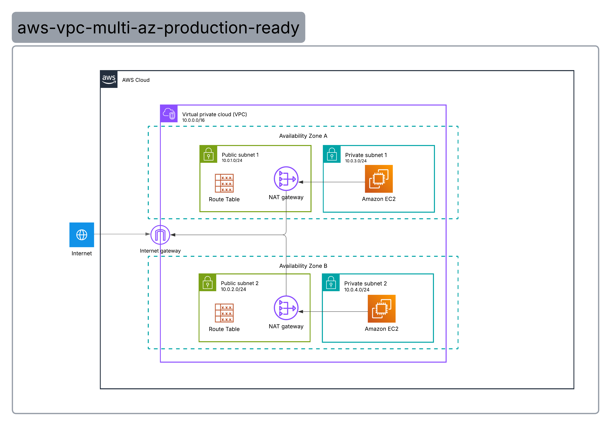

# AWS Multi-AZ VPC Architecture (Outbound Traffic Flow)

## 📌 Project Overview

This project demonstrates the design and implementation of a secure and highly available AWS Virtual Private Cloud (VPC) architecture.

The goal is to build a network infrastructure that strictly isolates compute resources in private subnets while allowing controlled internet access through NAT Gateways and routing outbound traffic securely via an Internet Gateway.

This architecture follows AWS best practices for networking and security (SAA-C03 level).

---

## 🏗️ Architecture Diagram

---

## ☁️ AWS Services Used

- Amazon VPC
- Amazon EC2
- Internet Gateway (IGW)
- NAT Gateway
- Route Tables
- Security Groups
- Elastic IP

---

## 🌍 Architecture Design

### VPC CIDR
- `10.0.0.0/16`

### Availability Zones
- AZ-1a
- AZ-1b

### Subnets

#### Public Subnets
- Public Subnet A (AZ-1a) → `10.0.1.0/24`
- Public Subnet B (AZ-1b) → `10.0.2.0/24`

#### Private Subnets
- Private Subnet A (AZ-1a) → `10.0.3.0/24`
- Private Subnet B (AZ-1b) → `10.0.4.0/24`

---

## 🔄 Traffic Flow (Outbound Traffic Only)

1. An **Amazon EC2 instance** in a Private Subnet initiates an outbound request (e.g., `sudo apt-get update`).
2. The request is intercepted by the **Private Route Table**, which targets all internet-bound traffic (`0.0.0.0/0`) to the **NAT Gateway** inside the same Availability Zone.
3. The **NAT Gateway** translates the private IP into its assigned public Elastic IP (Source NAT) and forwards the packets to the **Internet Gateway**.
4. The **Internet Gateway (IGW)** routes the traffic out to the public internet.
5. The response from the internet returns safely through the same path, allowed by the stateful nature of the components.

---

## 🧭 Route Tables

### Public Route Table (Associated with Public Subnets A & B)
- `10.0.0.0/16` → local
- `0.0.0.0/0` → Internet Gateway (IGW)

### Private Route Tables (Dedicated per Availability Zone)
- `10.0.0.0/16` → local
- `0.0.0.0/0` → NAT Gateway (Targeting the local AZ's NAT Gateway)

---

## 🛡️ Security Design

- **Complete Isolation:** Private EC2 instances have no public IP addresses and are completely unreachable from the public internet.
- **Unidirectional Access:** The NAT Gateways strictly allow outbound connections; no internet-initiated inbound connections can pass through.
- **Security Groups:** Enforce the principle of least privilege, restricting instance access to required internal communication only.

---

## 🖥️ Compute Layer

### Private EC2 Instances
- No public IP attached.
- Used to host backend workloads, application code, or databases requiring strict network security.

---

## 🧪 Validation Tests

- **Test 1 — Private Isolation:** Confirmed that private EC2 instances cannot be reached or pinged directly from the internet.
- **Test 2 — NAT Gateway Connectivity:** Verified that private EC2 instances can successfully access external internet resources to download packages and system updates.
- **Test 3 — Route Table Association:** Confirmed correct subnet-to-route-table mapping across both Availability Zones.

---

## 📸 Screenshots

*Place your lab validation screenshots here once deployed:*

### VPC & Subnets Overview

### NAT Gateway Configuration

### Connectivity Test (Outbound Ping Success)

---

## 🧠 Skills Demonstrated

- AWS VPC Core Networking Design
- Subnet Segmentation (Public vs. Private Subnets)
- IPv4 CIDR Subnetting & Planning
- Route Table Configuration & Subnet Associations
- NAT Gateway Redundancy & Internet Gateway Routing
- Multi-AZ High Availability Architecture
- Cloud Security Fundamentals

---

## 🚀 Future Improvements

- [ ] Add an **Application Load Balancer (ALB)** in the public subnets to securely handle inbound user traffic.
- [ ] Implement an **Auto Scaling Group (ASG)** for the EC2 instances to handle dynamic workloads.
- [ ] Deploy a **Bastion Host** or utilize **AWS Systems Manager (SSM) Session Manager** for secure SSH access.
- [ ] Convert this infrastructure into **Infrastructure as Code (IaC)** using Terraform.
- [ ] Configure **Amazon CloudWatch** dashboards and VPC Flow Logs for network monitoring.
